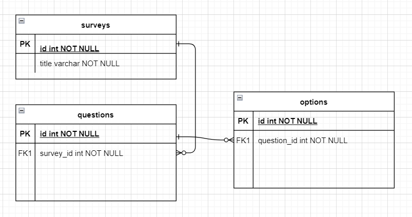

# Backend para gestión de encuentas

Esta basado en el patron arquitectónico Clean Architecture. 

## Estructura de modulos y paquetes

Se definió la siguiente estructura de módulos:

   * **application:** Este modulo se encarga de la logica de negocio de la aplicación, esta compuesto por los siguientes paquetes.
        * **usescase**
        * **port**
   * **domain:**  Son las entidades que representan los objetos de negocio.
   * **infrastructure:** Es donde está lo que puede cambiar en el tiempo, librerías, servicios externos, etc.
   * **bootrun:** Esta modulo no hace parte en sí del patrón, este es el que se encarga de arrancar la aplicación y ejecutar los test.
        

## Java Version
La version java que se desarrolló es la 11.0.5.

## Swagger
### Swagger json
http://localhost:8080/survey-core/api-docs

### Swagger UI
http://localhost:8080/survey-core/swagger-ui/index.html

### Diagrama Entidad Relación

